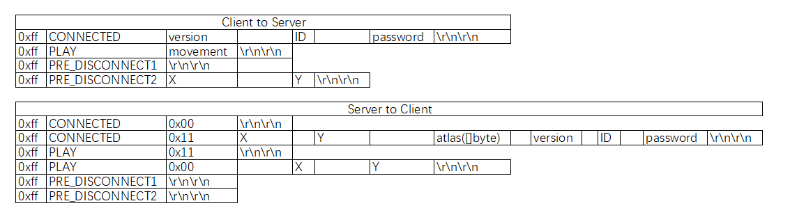
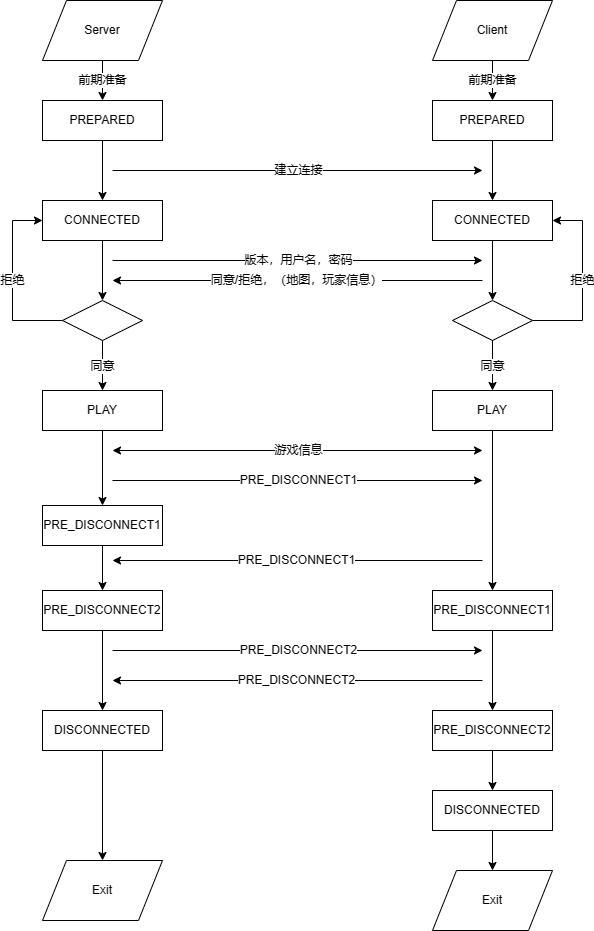

# Minecraft Server(Lite version)
  
> 前言  
> 运行须知  
> 程序信息  
> 总结与反思  

## 前言  
---
1. 【长文预警】，本文档超过三千字！（不好意思一不小心写了这么多qwq真的非常不好意思，但是似乎也没什么能删的，~~除了这句前言1~~）
2. 虽然周二在群里询问过题目有关问题，但是不保证提交的内容完全理解并实现了题目的要求（XD）。对于一个游戏服务器而言，设计还有相当多不完善的地方。请以程序实际效果为准。  
3. 在码代码的时候突然发现自己的思路就是让程序在几个状态之间来回横跳，于是干脆在main函数里用switch语句做了个简易版有限状态机...  
4. 另外，在Visual Studio Code的终端中运行时偶尔会出现客户端接收不到数据包的情况，但直接运行可执行程序时未出现上述问题。如果程序在意料之外的地方“无响应”，请尝试重新运行。

## 运行须知
---
* ### 客户端  
    1. 启动后依次需要输入的信息为：服务器IP（不包括端口，因为服务端固定监听25565端口），用户名，密码。  
    2. 使用<kbd>w</kbd><kbd>a</kbd><kbd>s</kbd><kbd>d</kbd>进行移动，每按下一个键后请记得按下<kbd>Enter</kbd>键。如果输入多个字符后按下 <kbd>Enter</kbd>，则只会读取第一个字符。  
    3. 在客户端正常游戏过程中输入<kbd>0</kbd>则会自动终止游戏并退出。请注意，此时服务端也会同步关闭。  
    4. 客户端及服务端不会处理对2、3所述以外的键位。  
    5. 为简化设计，可用账户只有一个。用户名：<kbd>Admin</kbd>密码：<kbd>acltql</kbd>（注意区分大小写）。
* ### 服务端
    1. 在客户端输入服务器IP之前，请确保服务器已经启动。  
    2. 为简化设计，服务端不需要进行任何除启动外的手动操作。   
    3. 服务器每次收到客户端发送来的数据时会在控制台输出一些内容，可能出现的有：来自客户端的数据包，即将发送到客户端的数据包，错误信息，其他提示信息等。

## 程序信息
---
（本部分内容较多，导览如下）
> 主要结构（struct）与常量  
> 客户端主要函数及功能介绍  
> 服务端主要函数及功能介绍  
> 通信数据包格式  
> 运行流程简介  
> 其他信息说明   
* ### 主要结构（struct）与常量
```go
type Coord struct {
	X byte
	Y byte
}
```
定义了一个二维坐标结构。考虑到题目要求的坐标范围并不大，故采用了`byte`类型。  
```go
type Player struct {
	nameInGame string
	password   string
	pos        Coord
}
```
定义了一个玩家结构。包括其游戏内昵称（用户名）、密码和坐标。  
```go
const (
	NONE  byte = iota
	UP         //x--
	DOWN       //x++
	LEFT       //y--
	RIGHT      //y++
)
```
这一组常量用于标识玩家的移动方向。不同常量所代表的坐标变化如注释所示。以下将这一组常量称为`Direction`  
```go
const (
	PREPARED byte = iota
	CONNECTED
	PLAY
	PRE_DISCONNECT1
	PRE_DISCONNECT2
	DISCONNECTED
)
```
这一组常量标识了程序所处的状态。以下将这一组常量称为`State`。服务端与客户端均有且仅有这六个状态，但转换状态的条件不尽相同。详见“运行流程简介”。
* ### 客户端主要函数及功能介绍
```go
func DialMC(ip *string) (net.Conn, error)
```
用于连接至指定服务器，并返回建立的连接。如果连接过程中发生错误则返回`nil`和对应的`error`变量。
```go
func SendPacket(conn net.Conn, args ...[]byte)
```
向指定的连接中发送数据。所有数据以`[]byte`的格式传入，`SendPacket`函数将其连缀成一个切片后一次性发送。每次发送的数据成为一个数据包，是服务端与客户端通信内容的基本单位。
```go
func (p *Player) PlayerIntro() []byte
```
将`Player`结构中的部分数据按照一定格式改写为`[]byte`类型并返回，便于将相关信息写入数据包。
```go
func Verify(conn net.Conn) bool
```
在登陆阶段被调用，处理指定连接中接收到的数据包。如果登陆成功，则读取服务器返回的玩家数据（客户端中`Player`类型变量为全局变量）并返回`true`；若登陆失败或数据包有误则在控制台输出对应信息并返回`false`。
```go
func GetKey() (byte, error)
```
用于获取键盘输入的第一个字符。对这一过程进行封装是为了增强语义性。
```go
func JudgeMove(move byte) bool
```
用于判断给定的方向能否进行移动。其中`move`的值为`Direction`之一。
```go
func Reprint()
```
以字符画的形式打印出当前的地图以及玩家位置。
```go
func SendPlay(conn net.Conn)
```
作为一个单独的协程使用。在`PLAY`阶段每隔50ms向指定连接发送一次数据包。
```go
func ResvPlay(conn net.Conn)
```
作为一个单独的协程使用。在`PLAY`阶段接收来自服务器的数据包，并据此对客户端数据进行修正。注意，该协程不会主动刷新屏幕，数据修正需要玩家主动刷新屏幕后才会体现。  
* ### 服务端主要函数及功能介绍
```go
func SendPacket(conn net.Conn, args ...[]byte)
func (p *Player) PlayerIntro() []byte
func JudgeMove(move byte) bool
```
这三个函数与客户端对应函数功能相同。
```go
func ProcessCONN(p *Player, conn net.Conn) (bool, error)
```
用于处理用户的登录请求。若版本、用户名、密码均正确，则返回`true`；否则向控制台输出拒绝连接的原因并返回`false`。同时向客户端发送数据包说明是否登陆成功。
```go
func GetPacket(conn net.Conn) ([64]byte, error)
```
考虑到服务器需要频繁接收数据包，便将该功能独立封装。`GetPacket`函数接收数据包并作初步检验，随后返回接收到的数据包与产生的错误信息。
```go
func LinearAtlas() []byte
```
用于将地图转换为一维`byte`类型切片并返回，以便写入数据包。游戏内的地图为全局变量，声明为二维`byte`数组。
* ### 通信数据包格式
> 统一格式为标记（0xff，1byte），类型（或状态，1byte），数据（长度不固定），结尾。  
> 不同数据间以空格分隔，数据包以`"\r\n\r\n"`结尾  



* ### 运行流程简介  


* ## 总结与反思  

> 你觉得解决这个任务的过程有意思吗？  

有意思。对我而言这是第一次完整而彻底的对网络开发的接触，当我看到服务器上显示出来自客户端的问候时，那份激动不亚于第一次写出Hello World。言归正传，尽管前前后后遇到了不理解题意、外语文档阅读速度慢等困难，也出现了非法格式的数据包、协程接收不到channel中的信号等等bug，甚至一度觉得我是不是可以去B站当一名bug区up主（doge），但一切debug中的烦躁都随着最后一次测试中成功关闭的窗口而烟消云散了，留下的是内心的满足与快乐。简言之，在与bug的斗智斗勇中完全依靠自己取得胜利相当有意思的噻：）

> 你在网上找到了哪些资料供你学习？你觉得去哪里/用什么方式搜索可以比较有效的获得自己想要的资料？

首先是题目中包含的链接：维基百科，菜鸟教程，以及编程语言的官网等。  
其次是技术论坛或个人主页：CSDN，StackOverflow，技术人员自己的博客或笔记等。  
然后是Github。放在靠后的位置并不是说他不好，只是因为开发过程中的多数问题是语言基础或库函数的问题，用不到他出马XD  
最后，当上面的方式都没能解决我的问题时，把问题扔给搜索引擎孤注一掷QWQ。偶尔能查到有用的东西，但大多数时候还是归究到官网或者博客上。  
我觉得，对于比较有把握能用搜索引擎找出来的东西，可以丢给搜索引擎；对于明确知道应该去哪找答案的问题，直接步入正题；而对于非常个性化的问题，可以在论坛搜索或者提问。不过最好注意下“提问的艺术”XD  

> 在过程中，你遇到最大的困难是什么？你是怎么解决的？  

对我个人而言，这一过程分为两部分，学习部分和开发部分。  
学习过程中最大的困难莫过于学习一门新语言。虽然Golang和C非常相似，并且不是OOP语言，但在真正码代码时出现的问题远比想象中多。对此我的策略是用Golang重写学习C时的程序。而对于开发过程中才遇到的语言问题（比如`select`语句），我会在另一个程序中进行测试，直到确保自己已经知道了所有可能用到的“特性”（~~可以，这很MC~~）。  
开发过程中最大的问题毫无疑问，一定是各种奇怪的unexpected数据包了，包括但不限于收到没有`0xff`标记的数据包，受到本应停止发送的数据包，以及在奇怪的地方阻塞导致完全收不到数据包（~~我裂开来~~），这些问题远比学习语言的困难要大得多。解决方式简单概括就是debug和重写。  
比如玩家的y坐标总是会从0变为255，先逐步定位到`Judgemove`函数中，又通过脑中的模拟运行最终确定是逻辑错误；比如让服务器每次接收数据时把数据包完整输出到控制台，从而得知是客户端某个协程没有终止导致数据包发不出来；再比如服务端发送的数据包出现状态（State）错误的现象，解决方案是重写了处理数据包的`Process()`函数，整合到了`main()`函数中。诸如此类debug的过程持续了将近两天（因为要上课所以每天能用的时间不会特别多），好在最终全部解决了  

> 完成任务之后，再回去阅读你写下的代码和文档，有没有看不懂的地方？如果再过一年，你觉得那时你还可以看懂你的代码吗？  

并没有。如果到时候我还记得Golang，应该还是看得懂的。我觉得平心而论，这次的任务不算复杂（但是当然不排除是我误解提议导致的），代码中语意重复的部分比较多，整体逻辑也是简单的“我收到信号，所以我要做某件事，并且发送另一个信号”。最难理解的部分或许就是我为有限状态机设计的略显臃肿的跳转逻辑（~~自己被自己蠢哭~~）。如果一年后还能拿到我写的这份文档，尤其是那张流程图的话，看懂还是不成问题的。  

> 其他想说的想法或者建议。  

1. 再次抱歉我写了这么长qwq先给被迫读我文档的uu一个诚挚的道歉  
2. 完全自学某样东西难度还是不小的，手头资料完整程度无从得知，遇到问题茫然不知所措，如果身边有学过的或者正在一起学的人还可以相互讨论，“教学相长”（~~虽然很不想说这种从高中那种学习环境下继承下来的词~~），但有个人一起确实可以大大降低学习成本，增加学习速度。所以（~~其实不构成因果关系~~），好想进QSC！（此处应有一个星星眼表情）